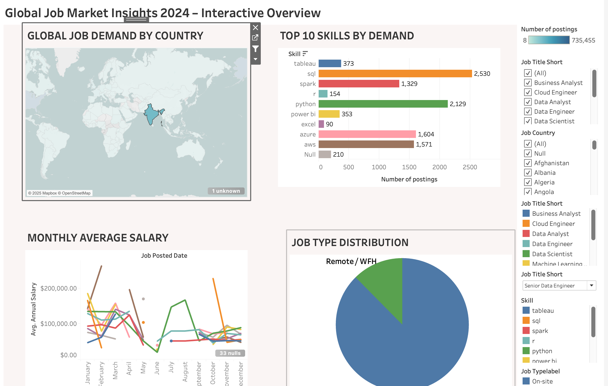

# Global Job Market Insights (Tableau Dashboard)

An interactive Tableau dashboard that visualizes global hiring demand, salaries, top skills, and work type distribution (Remote / On-site).

---

## Live Dashboard
Click below to explore the interactive dashboard:  
[View on Tableau Public](https://public.tableau.com/views/Global_jobmarket_dashboard/Dashboard2?:showVizHome=no&:embed=true)

---

## Dashboard Preview

---

## Key Insights
- Global Job Demand by Country – See which countries are hiring the most.  
- Monthly Average Salary Trends – Compare pay trends for different roles.  
- Top 10 Skills in Demand – Identify the most valuable tech and analytics skills.  
- Remote vs On-site Distribution – Understand how work models vary across markets.  

---

## Tools Used
- Tableau Public for visualization  
- Python (Pandas) for data preparation  
- CSV dataset for job postings and skills  

---

## Download Workbook
Download the Tableau file to explore locally:  
[Global_Job_Market_Insights.twbx](Global_Job_Market_Insights.twbx)

---

## Author
**Shanmukh Anvesh Sarepalli**  
[GitHub Profile](https://github.com/anveshsarepalli21)
